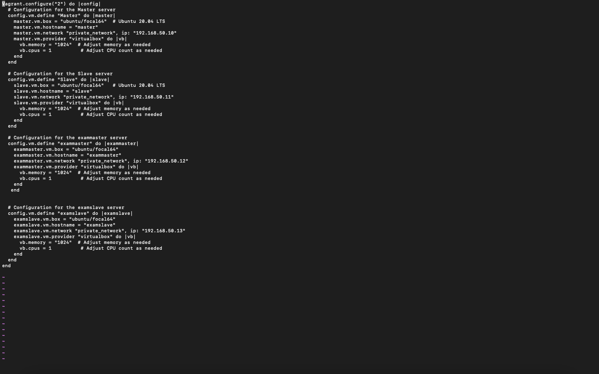
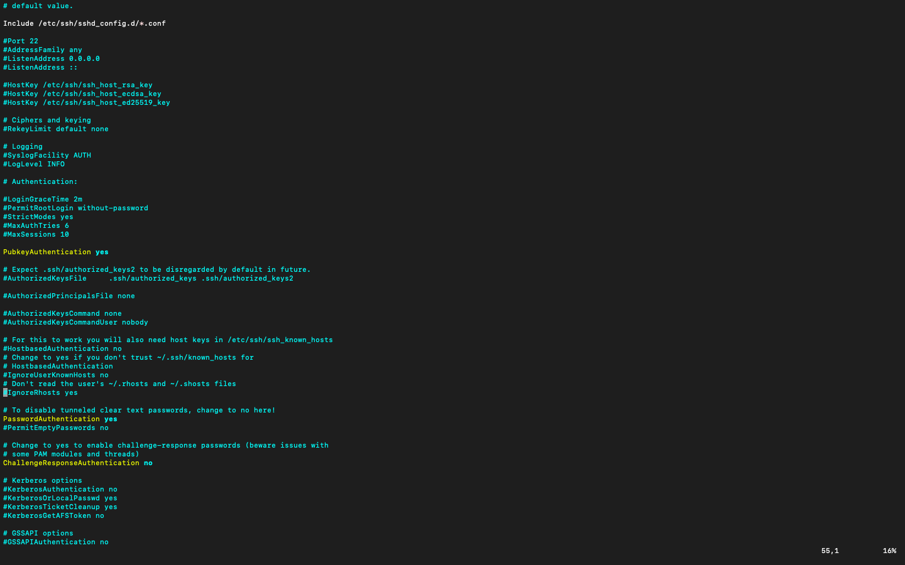
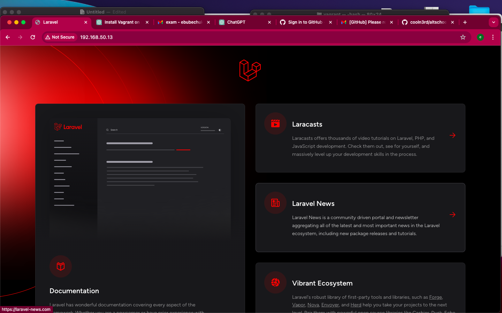

# SETTING UP A LAMP STACK USING ANSIBLE 

First i wrote the configuration of vagrant on my vagrantfile

then i ssh into my exam master using vagrant command 

vagrant ssh exammaster 

once i was created a file called lamp using 

mkdir lamp 

then i created a bashscript that deploys the lamp and laravel application , called the bash script lamp.sh 

then ran the bash scrip on my exammaster to see that it runs fine 

command: ./lamp.sh 

when it ran successfully 

i brought up my examslave using 

vagrant up examslave 

once my examslave node was up i cd into /etc/ssh/sshd_config this allowed me make some change to the sshconfig allow me push the publickey of exammater to examslave 

once i was done with this i did an ssh key-gen on my exammaster to create my private and publickey 

then i ran the below to copy my exammaster publickey to my examslave 

command : ssh-copy-id vagrant@192.168.50.13 

once this was done , i set up my ansible by running the below command

sudo apt install -y software-properties-common python-apt 

then 

sudo install ansible -y 

created the host-inventory 

ran ansible all -i host-inventory -m ping 

tp test that i can connect to my slave

thn ran ansible-playbook lamdeployment.yml -i host-inventory -- check to check tthat all is well 

then ran nsible-playbook lamdeployment.yml -i host-inventory to push to my examslave 

then test that my examslave deployed well 

